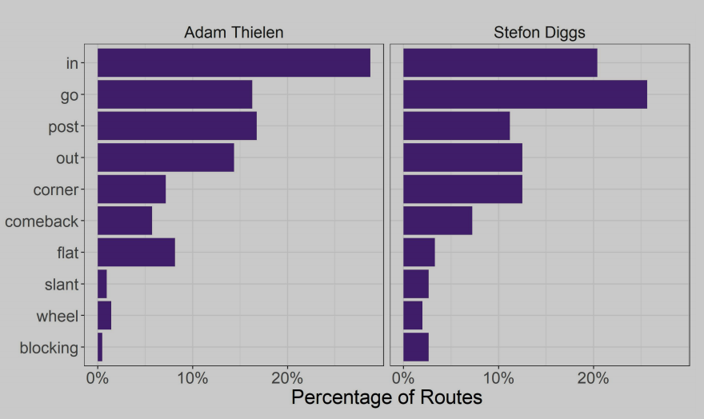
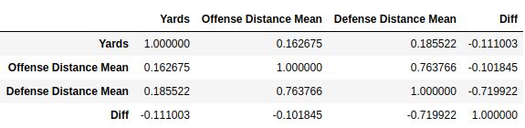
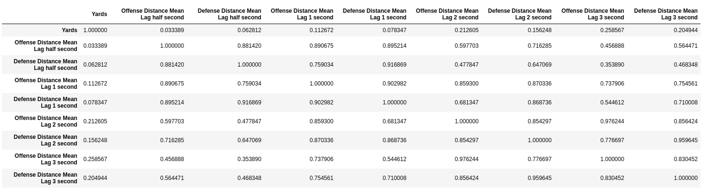

# 《big-data-bowl-sfu》译文

关键字：`路线组合`、`模式识别`、`EPA`、`控制区`、`开放区`。

## 简介

在国家足球联盟（NFL）中执行传球是进攻成功的关键，尤其是在新的足球时代，人们越来越重视**传球**。今年，拉拉姆斯队的教练肖恩·麦克维（Sean McVay）因其进攻计划而受到传闻（西蒙斯，2018）。各队都在不断努力提高自己的进攻能力，由于麦克维的成功，他们也在努力寻找一位类似的主教练（威利斯，2019年）。然而，提高他们的攻击力可能比雇佣任何与麦克维有过眼神接触的人都容易，因为跟踪数据可以有效地帮助设计更好的攻击。
> 传球很重要，即一个优秀的四分卫对进攻的影响是很大的，一般也是工资最高的那个；

下一代统计的球员跟踪数据，从所有的NFL比赛是所有32个NFL球队在本赛季第一次提供。自2013年以来，NBA也有类似的数据（NBA，2013）。这鼓励了更多关于使用跟踪数据改进运动策略的公开文献。例如，Miller和Bornn（2017）对功能数据使用了概率聚类算法，以识别NBA控球中的常见行为。同样的策略也适用于NFL中类似的**传球路线**。它还可以扩展到识别防守队形、拦截和跑位。
> 目前跟踪数据分析行为在各个运动领域都有应用；

尽管在NFL大数据碗之前，足球中的跟踪数据的访问是有限的，但已经通过nflscrap R包公开了逐场数据（Horowitz等人，2018）。利用该数据，Yurko、Ventura和Horowitz（Yurko等人，2018）提出了一个期望加分（EPA）模型、赢取概率加分模型和赢取替代模型。这些指标和数据集的使用给NFL分析注入了活力，为我们建立了一个坚实的基础，现在我们可以扩展它了。
> 之前有人通过R包分享过数据，且建立了一些模型；

我们也将建立在调整的正负模型的基础上，使用回归技术在篮球（罗森鲍姆，2004），曲棍球（麦克唐纳德，2011）和足球（马塔诺等，2018）。特别是在（Macdonald，2011）和（Sill，2010）中，作者使用岭回归来处理数据中的协线性。调整后的正负模型的思想是，在给定的绩效指标上隔离球员的边际效应，考虑到他们的竞争**对手**和**队友**。我们建议使用一个类似的框架来评估**路线组合**的有效性，同时考虑到**防守人员**和其他在战场上**运行的路线**。
> 模型将基于岭回归，隔离边际效应，同时考虑队友和对手；

我们还探讨了所有接球球员在球扔出时的**开放性**概念，以及如何将这种开放性理解为成功，不仅仅是目标球员，而是其他人通过将防守球员从球中带走为他们创造了**空间**。我们想象每个队在球场上的**控制力**，以及从投球到接球的变化。
> 通过定义开放性，即接球手在球扔出时的空间，以及其他队友为他创造的空间等，双方的控制力；

在本报告中，我们提议作出以下贡献：
1. 基于模型的功能数据聚类方法识别NFL路径；
2. 不同情况下最优路径组合的选择；
3. 一种测量**开放性**的方法，用于分析路线组合在控制现场方面的有效性；

## 模式识别：路线

本次比赛公布的跟踪数据涵盖了2017年NFL常规赛前6周91场比赛的所有财产。要识别在传球上运行的路线，我们使用以下步骤转换数据。

首先，我们确定了所有的传球，只保留了前锋（WR）、跑卫（RB）、后卫（FB）和边锋（TE）的跟踪数据。所有路线都分析了共同的比赛方向，混战线，开始时的水平原点。我们删除了发球前，开始后数据（定义在apendix）。依照（Miller and Bornn，2017）的工作，并使用Bezier曲线（Olsen，2018）来平滑路线曲线。曲线需要双倍的观测值来控制play中的点（帧），因此所有2秒或更少的play都从跟踪数据中删除。
> 传球中只保留了前锋、跑卫、后卫、边锋的数据，删除发球前动作、比赛后移动，平滑了曲线；

然后，我们从贝塞尔曲线中抽取200个均匀分布的x、y点，并使用功能数据的基于多元模型的聚类（Bouveyron和Jacques，2011年）对这些点进行聚类，这些功能数据是在funHDDC R包（Schmutz和Bouveyron，2018年）和fda R包（Ramsay等人，2018年）中实现的。
> 从贝塞尔曲线中取点，进行多元模型的聚类；

我们运行了10、15、25和50个簇大小的聚类过程。我们选择使用50个簇的结果；这是因为使用更多的簇时，它在路线模式识别上区分了更多的水平变化，而不是仅在目标深度上进行聚类。
> 选择簇为50进行聚类；

每个簇都是清晰且有明显差异的，我们在数据集中看到了不同的路线，看起来有机会手动将相似的簇放到组中。在图1中，我们为10个路线组中的9个绘制了球场左侧和右侧两种情况。

这些路线组为我们提供了对象用足球术语来描述比赛。

### 球员的路线趋向

一个例子：使用我们确定的路线来查看同样的进攻中不同队友的使用情况。在图2中，我们比较了维京人的队友蒂伦和迪格斯。迪格斯比蒂伦走的路线要多。蒂伦走的更远时喜欢使用post路线；

这些路线的类型可以基于路线习惯对接球人进行聚类，无需聚类，我们仍然可以通过球场位置分组来查看不同玩家的独特路线轮廓，在图3中，我们可以看到三位球员的路线图是符合我们对他们行为的直觉判断的；

这些**路线简介**可以用来**侦察**和**描述**进攻趋势，同时它也证明，我们已经具备对路线进行聚类和标签的适当方式。

## 评估战术设计

### 期望加分指标

一种Play战术可以被评估是基于性能的指标，使用EPA来评估路线；

这样做的问题是：当评估结果不好时，实际结果可能是好的，反之亦然，这是因为球员的个人能力、状态对结果有影响，而这不能说明战术不好；

可以通过可视化玩家的控制区域来评估他们是否表现出色，这是他们的动作在球场上创造了空间的结果，而不是传球成功与否的结果；

### 控制区和开放区

我们可以使用基于过程的方法来评估战术，而不是只看传球的结果，在当前数据集评估战术有一些难点。首先是了解在游戏设计、覆盖模式和玩家开放性的前提下，对游戏所做的决定是否是最好的决定。量化了进攻和防守在传球过程中对比赛区域的控制。球员“开放性”分析的输出允许对球场控制的视觉理解，以及如何从球被扔到球被抓住时的变化。
> 评估战术，而不只看结果，量化球员对比赛区域的控制，通过开放性；

控制区是用**二元正态分布**来测量的，该正态分布考虑了在一个时间点上所有球员的速度和方向。非接球人为接球人创建空间的贡献很容易可视化。总有一天，这可以被用作分析进攻的工具，以便更好地了解路线组合和地图上的最佳抓捕区域。我们也可以根据个人表现来衡量比赛的结果，而不仅仅是看是否获得了码数/触地得分。
> 二元正态分布测量控制区；

我们可以用EPA来评估战术的成功，虽然证明一个选择比另一个更好是比较困难的。

## 对路线组合进行建模

通过建立两个岭回归模型来确定路线组合。

### Complimentary路线组合

在这两个岭回归模型下，out+go的路线被证明比平均要好。我们找了一场野马vs突击者的比赛，out路线对go路线进行了有效的补充，它将对方的防守后卫从go路线上带走，从此对进攻产生了影响；
> 多个路线的组合，互相影响；

### 路线组合的平均球场控制

在球被四分卫传出后，可视化球场上的控制区域，我们可以看到进攻方（红色）为接球人向球场上方移动创造了空间，通过正确合理的路线组合设计，球场上69%的区域控制属于进攻方，这也为持球人提供了更大的活动空间可以获取更多的码数；
> 制造空间，极可能的增加本方的控制范围，且围绕在持球人的路线上；

## 结论

根据可用的数据，我们对路线进行了聚类，并根据成功率和是否改进了团队的EPA对组合进行了分析。我们确定了在这两个类别中我们认为一致强的路由组合的数量。我们有能力根据球员的方向和速度来观察比赛，以确定哪些区域在他们的控制之下，我们将其扩展到团队控制，以可视化路线组合对为目标接受者打开场地的影响。

## 回到竞赛

问题转为如何通过22个球员的信息，量化出进攻方的进攻影响区、持球人的开放区，防守方的防守影响区；

球场之上的几个元素：持球人、为他创造空间的队友、压缩他空间甚至截断他的对手，队友里又分直接为其开路的、分散对方注意力的，对手里分阻碍其队友的、试图截断他的，这些元素的互相作用得到了当前的一个空间控制环境，通过该环境可以量化空间状态，预测码数；

可以使用的球员信息包括：`速度`、`加速度`、`X`、`Y`、`Orientation`、`Dir`、`YardLine`、`PlayerHeight`、`PlayerWeight`；

step by step:
0. 先看看原始的rusher的X,Y,A,S的相关性，一般模型下这四个是对结果影响最大的；

1. 目前这个思路下最简单的能够构造的`球场控制因子`：只考虑每个球员的**XY**，以持球人为原点，计算其他球员到他的距离，暂时生成两个特征，队友平均距离、对手平均距离；

2. 按照目前的情况，计算在0.5s、1s后的队友平均距离、对手平均距离；

3. 0,1,2,3秒后3,5码内的对手数量；

4. xxxx
