# 深入分析tracking数据

一些概念、关键点、notebook解释链接：
- [NFL tracking: wrangling, Voronoi, and sonars - R](https://www.kaggle.com/statsbymichaellopez/nfl-tracking-wrangling-voronoi-and-sonars)
- [initial wrangling & Voronoi areas in Python - Python](https://www.kaggle.com/cpmpml/initial-wrangling-voronoi-areas-in-python)
- [泰森多边形-Voronoi](https://baike.baidu.com/item/%E6%B3%B0%E6%A3%AE%E5%A4%9A%E8%BE%B9%E5%BD%A2/3428661?fromtitle=voronoi&fromid=9089406&fr=aladdin)：通过Voronoi可以有效的可视化球员的理论控制区域，在不考虑球员个人身体素质，当前状态(速度，加速度，角度，面向)的情况下，这个图看到让人全身发抖，学到了学到了；

## Python版本
https://www.kaggle.com/holoong9291/nfl-tracking-wrangling-voronoi-and-sonars-python

## 整体的分析流程
1. 坐标体系标准化
    1. 基本数据操作
        1. 加载数据；
        2. 构建ToLeft、IsBallCarrier特征；
        3. 处理异常的球队名数据；
    2. 绘制回合图
        1. 绘制6个回合；
        2. 区分进攻、防守、持球人；
    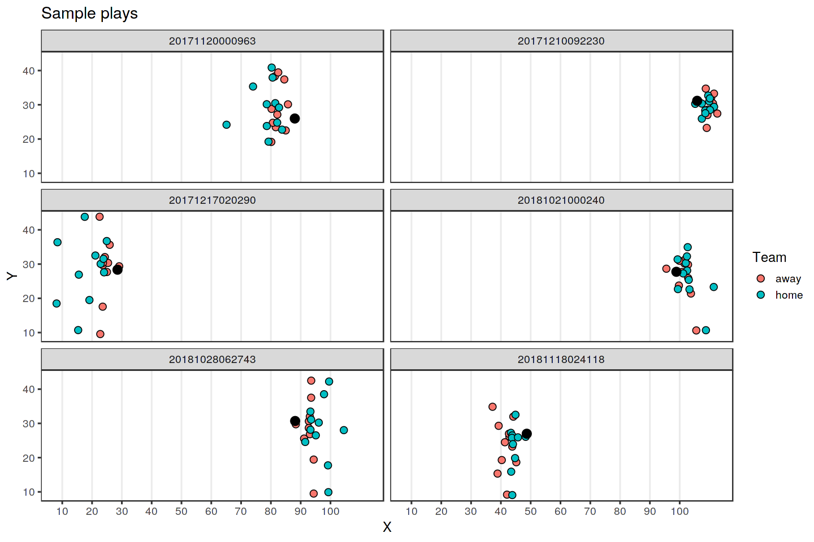
    3. 调整进攻方向
        1. 将所有进攻都调整为从左往右，方向后续可视化以及视觉效果；
        2. 通过YardLine、FieldPosition、X、Y等；
        3. 展示统一方向后的回合图；
        4. 下图：蓝色是进攻方，红色是防守方，且蓝色一直是从左向右进攻，虚线是回合开始的地方，码数大于0说明在虚线右侧结束回合，小于0说明在左侧结束（被擒抱损失码数的情况下）；
    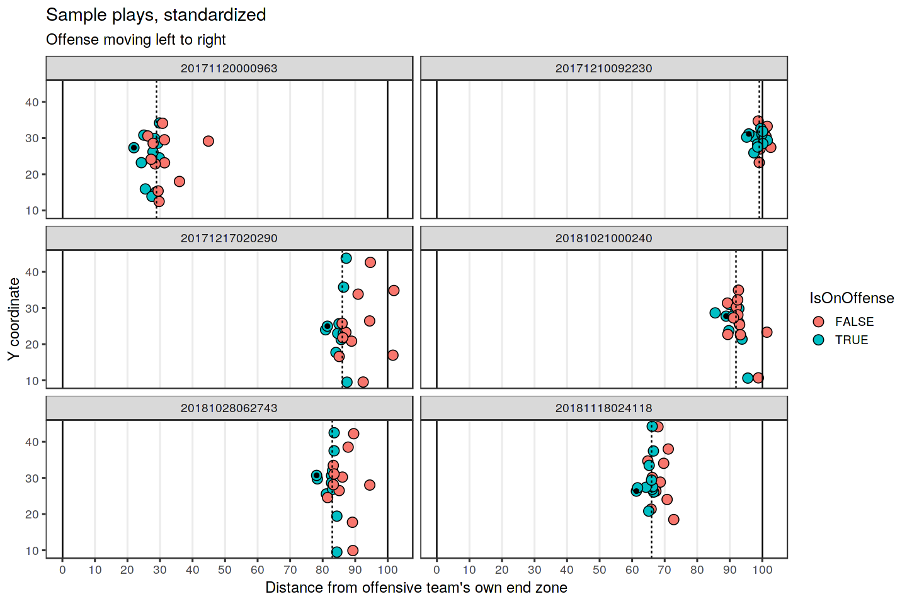
2. 球员空间和Voronoi区域
    1. 比赛的关键在于找到橄榄球的特有特征，这使得数据更具表达力；
    2. 初步思考：持球人的**空间**（这一点我的kernel也考虑了，验证结果仅仅提升了0.0002，应该没有挖掘到更关键的点）；
    3. 空间：持球人的空间越大，更准确的说是从左向右进攻时前面的空间越大，越容易获得更多的码数（这里我之前计算的方式只考虑了距离，没有考虑空间，也就是面积，主要是没有找到一个量化空间的算法）；
    4. 量化算法：**Voronoi**是一种将空间划分为最近的点的方法，通过它可以初步的对球场控制区域进行划分；
    5. 看下图：每个球员（点）都有自己对应的空间，有的大有的小，这里就没有考虑球员的差异性，仅考虑点间的距离，这里只对一部分区域多了空间划分，不是全场，这个全场意义也不是很大，因为随着球员的移动(不同速度)，这个空间的划分有很大的变化，其距离越远，影响越小；
    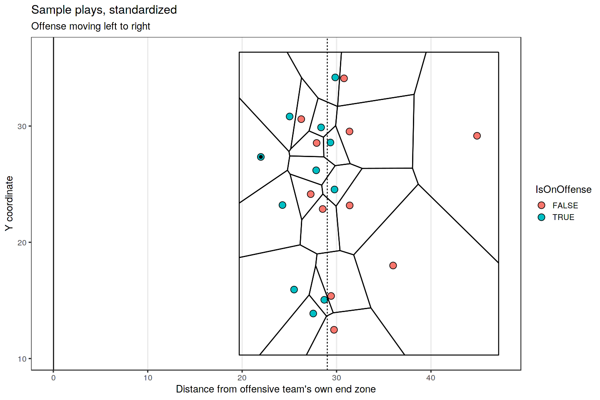
    6. 对于进攻方来说，持球人（或许还有他的队友）的空间对于码数是至关重要的；
    7. 重要提示：不同方向速度下单个球员的影响力辐射图，下图；
    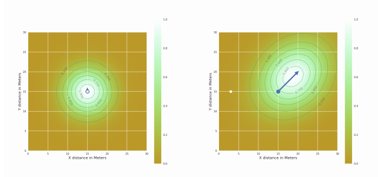
    8. 再来看整个球场的热图：
    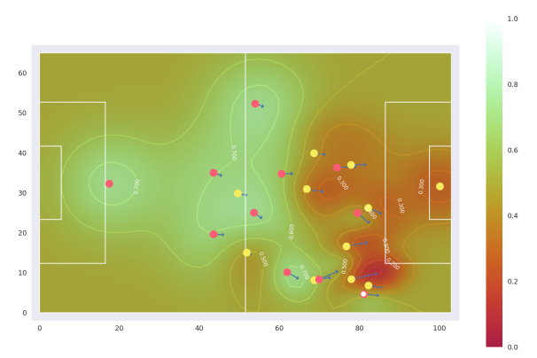
    9. 将持球人队友从Voronoi中去掉，意思是他的队友不会每一个都精准的给他提供空间帮助，另外注意力可以放到持球人上，看下图；
    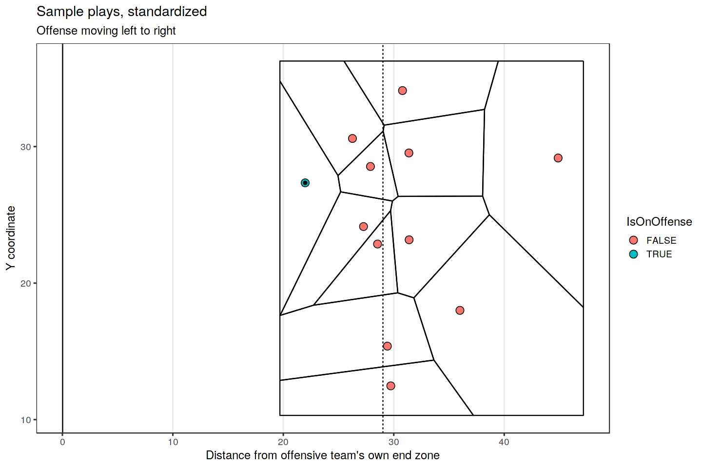
3. 球员的方向
    1. 接下来考虑球员的方向，这很重要，对于持球人，他面前的空间对码数影响更大，从控制区出发，球员也是主要控制自己面前的区域而不是周围；
    2. 首先我们需要标准化球员的方向，出于两个考虑：
        1. 135度和315度可能是同一个角度，取决于进攻方向，而这种信息对模型是不友好的；
        2. 关于足球的那篇pdf中量化了考虑方向下的球员影响区域热图，为了对齐，也需要标准化方向信息；
    3. 对Dir字段的标准化如下：
        1. 0度：进攻球员完全向左移动；
        2. 90度：进攻球员正向前移动，朝向对手的末端区域；
        3. 180度：进攻球员完全向右移动；
        4. 270度：进攻球员向后移动，朝向自己球队的终点区域（这通常很糟糕）；
    4. 标准化步骤：
        1. 先从持球人开始，因为他的信息对码数影响最大；
        2. 传播到所有球员；
    5. 看下图，原始的Dir信息柱状图来展示球员的前进方向分布，向进攻方向的右后方的方向很少，比较多集中在正面、偏左、偏右移动；
    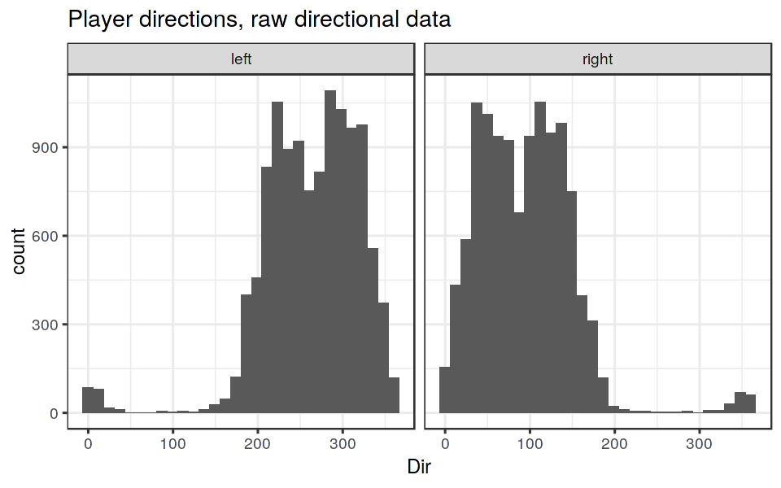
    6. 因为0度和360度其实是一个方向，所以标准化要处理这点，看处理后的；
    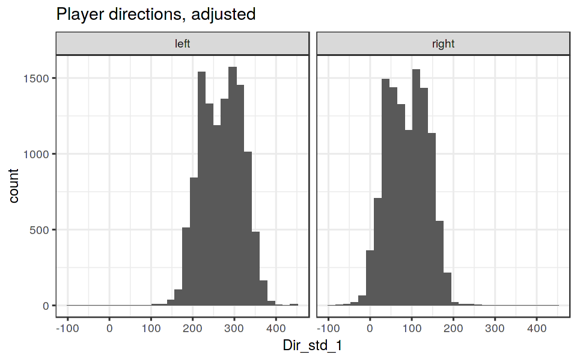
    7. 标准化2；
    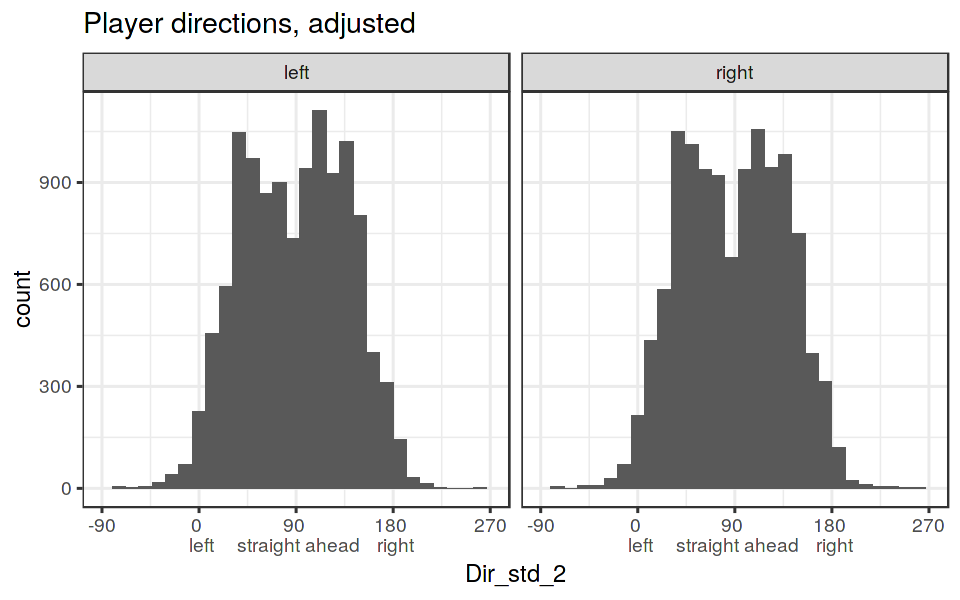
    8. 两个回合中关于方向问题的分析：
        - 回合1：Mike Tolbert想左前方推进，最终推进了14码；
        
        - 回合2：LeSean McCoy接过球，向右移动推进；
        
4. 球员方向的角度图表（至此，其实基本内容我也考虑过，但是不够深入，比如对于Dir的处理没有加入，应该也影响了最终结果）
    1. 每个球员是一个箭头，箭头指向是他的移动方向，箭头的头部就是他handoff一秒后的位置，看下图；
    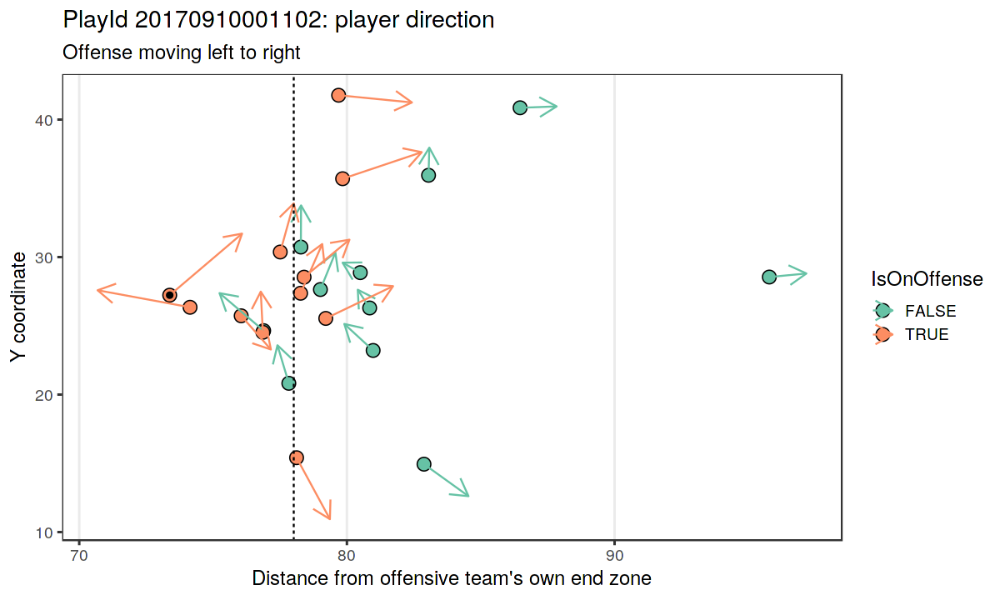
    2. 可以看到，gif中显示的球员移动情况跟这个图是相似的，说明数据在1秒内还是有延续性的；
5. 跑卫声呐图
    1. 声呐图用于可视化跑卫对于移动方向的倾向性；
    2. 通入引入成功率的信息，表示每种选择的成功率；
    3. 成功率定义：down=1,2时，yards > distance/2，down为3,4时，yards > distance，其实就是对能否获取首攻的一个量化方式，第一二次进攻时，能够达到所需距离的一半，第三四次进攻时达到所需距离，均为成功；
    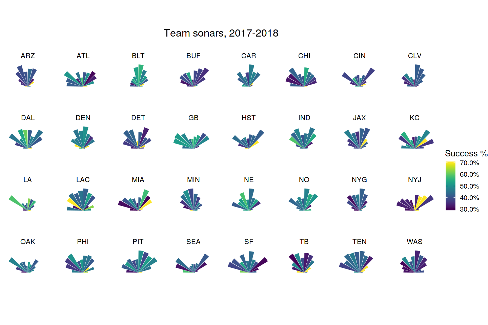

## 更重要的问题
如何将上面这些分析结果转为特征，并验证其有效性，目前更多是理论上的支持，比如空间对进攻的重要性，但是如何量化一个空间指数？？？

已有信息：
1. [Voronoi](https://liaocy.net/2018/20180614-voronoi/) - [scipy.spatial.voronoi](https://docs.scipy.org/doc/scipy/reference/generated/scipy.spatial.Voronoi.html)
2. Dir
3. S

类似论文中的足球影响空间热图，构建橄榄球的空间热图，模拟从handoff到1秒（之所以是1秒，可以理解为在刚开始的1秒内，防守球员处于初始移动状态下，而1秒后会根据实际持球人来调整自己的移动方向，而这时的数据我们是没有的，所以只考虑handoff以及假设1s内不改变方向、速度、加速度的1秒后，这两个时间点）后，这两个状态下的进攻方空间指数，理想情况下这应该与Yards关系很大，假设每个球员都像一个石子丢入水中，波纹就是他的影响范围，如果是正中丢下去，那么波纹是圆形，如果是斜着丢（球员带有初始速度和加速度和方向），那么波纹也应该是倾斜的，对于每个球员都可以以某种方式量化他对于球场中任意一点的影响因数，22个球员叠加，就是整个球场的热图；
